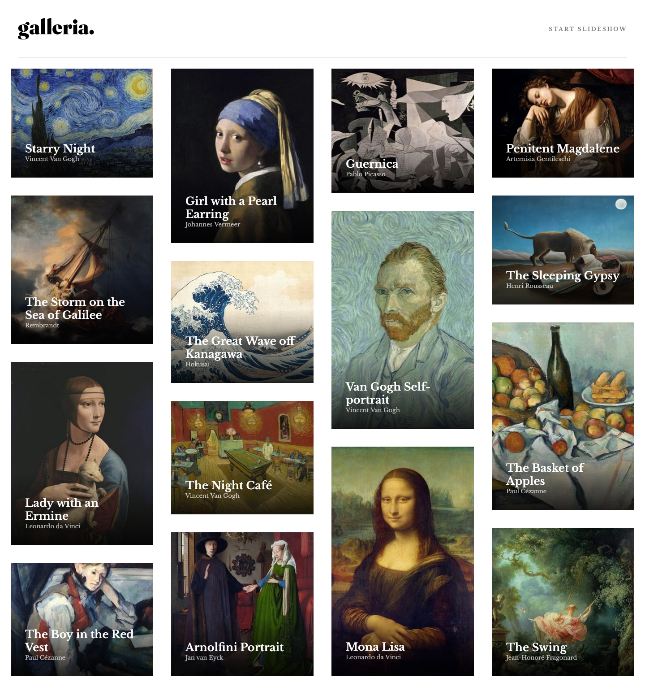

# Frontend Mentor - Galleria slideshow site solution

This is a solution to the [Galleria slideshow site challenge on Frontend Mentor](https://www.frontendmentor.io/challenges/galleria-slideshow-site-tEA4pwsa6).

## Table of contents

- [Frontend Mentor - Galleria slideshow site solution](#frontend-mentor---galleria-slideshow-site-solution)
  - [Table of contents](#table-of-contents)
  - [Overview](#overview)
    - [The challenge](#the-challenge)
    - [Screenshot](#screenshot)
    - [Links](#links)
  - [My process](#my-process)
    - [Built with](#built-with)
    - [Useful resources](#useful-resources)
  - [Author](#author)

## Overview

### The challenge

Users should be able to:

- View the optimal layout for the app depending on their device's screen size
- See hover states for all interactive elements on the page
- Navigate the slideshow and view each painting in a lightbox

### Screenshot

### Links

- Solution URL: [Mobile-first solution using React and NextJS](https://www.frontendmentor.io/solutions/mobilefirst-solution-using-react-and-nextjs-je9ptlPq58)
- Live Site URL: [Galleria](https://azganoth.github.io/galleria-slideshow-site/)

## My process

### Built with

- Semantic HTML5 markup
- CSS custom properties
- Mobile-first workflow
- [React](https://reactjs.org/) - JavaScript library
- [Next.js](https://nextjs.org/) - React framework

### Useful resources

- [Next.js Github Pages](https://github.com/gregrickaby/nextjs-github-pages) - This helped me setup github pages for NextJS framework.

## Author

- Website - [Ademir José Ferreira Júnior](https://github.com/Azganoth)
- Frontend Mentor - [@Azganoth](https://www.frontendmentor.io/profile/Azganoth)
